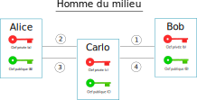

Activité : Certificats
======================

.. _`ANSSI`: https://www.ssi.gouv.fr/

Attaque dite "Homme du milieu"
------------------------------

Alice et Bob veulent échanger de façon sécurisée en utilisant une clé de chiffrement symétrique. Pour échanger cette clé, ils utilisent le chiffrement asymétrique.

.. image:: ../img/rsa.svg
   :alt: rsa.svg
   :align: center

Carlo, un hacker, réussit à intercepter les messages envoyés entre Alice et Bob. C'est une attaque appelée "homme du milieu" (man on the middle attack).

On note :math:`a`, :math:`b` et :math:`c` les clés privées de chacun et :math:`A`, :math:`B` et :math:`C` leurs clés publiques.

Bob envoie sa clé publique à Alice pour qu'elle envoie un message chiffré. Expliquez comment l'attaquant intervient lors de cette attaque qui se déoule en 4 temps.

Certificat
----------

Comme on vient de le voir, même s'il est possible de chiffrer une communication, cela n'assure pas la sécurité de la communication. Il faut s'assurer que celui qui envoie un message est bien celui qu'il prétend être.

Il existe un moyen d'être assuré de communiquer avec la bonne personne avec l'usage d'un **certificat**.

Un **certificat** est un fichier qui contient des informations sur une personne ou une entité numérique (site web) et qui permet de l'authentifier.

#. Connectez-vous au site de l'agence nationale de la sécurité des systèmes d'informations ANSSI_.
#. Sur la page d'accueil du site, à gauche de l'url dans la barre d'adresse se trouve une icone qui affiche un menu en cliquant dessus. Vérifier que la connexion est sécurisée avec un cadenas. Cliquer dessus et afficher le certificat.
#. Repérer les informations suivantes contenues dans le certificat:

   a. L'entité numérique (nom de domaine) qui est authentifiée par ce certificat .
   b. L'algorithme de chiffrement utilisé pour créer le certificat.
   c. La présence de la clé publique chiffrée et sa taille.
   d. Les dates de validité du certificat.
   e. L'autorité qui a émis ce certificat.

   .. tip::
      
      Il est possible d'obtenir les informations du certificat en ligne de commande avec openssl.

      .. code-block:: bash

         openssl s_client -connect url_du_site:443