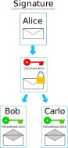
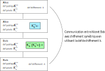

La cryptographie asymétrique
============================

Le chiffrement asymétrique a été créé dans les années 1970 pour communiquer de façon sécurisée sans avoir à échanger de clef de chiffrement.

.. admonition:: Principe
   :name: principe
   :class: definition

   Le principe du chiffrement asymétrique repose sur une paire de clefs:

   -  une clef privée qui doit rester secrète, 
   -  une clef publique qui est communiquée.

.. admonition:: Chiffrement
   :class: propriete
   :name: chiffrement

   On peut chiffrer des messages de 2 façons différentes pour 2 usages distincts.

   - On chiffre un message avec la clé privée. La clé publique permet de le déchiffrer. Cette méthode permet de **signer** le message.
   - On chiffre un message avec la clé publique. La clé privé permet de le déchiffrer. Cette méthode permet une **communication cryptée**.

Le système RSA
--------------

Le système RSA est un chiffrement asymétrique inventé par **Rivest**, **Shamir** et **Adleman** en 1977.

La paire de clefs est construite par un algorithme qui s'appuie sur les nombres premiers. On dispose d'une clef publique :math:`K^{pub}`, d'une clef privée :math:`K^{prv}` et une fonction de chiffrement par clef qui vérifie les propriétés suivantes:

-  On obtient le message initial :math:`m` en le chiffrant successivement avec la clef publique et la clef privée : :math:`K^{pub}(K^{prv}(m)) = K^{prv}(K^{pub}(m)) = m`
-  Il est impossible connaissant le message chiffré de deviner le message initial en clair;
-  Il est impossible connaissant la clef publique de deviner la clef privée associée.

Signature d'un message
----------------------

Lorsqu'on reçoit un message, rien ne garantit l'origine de celui-ci. Pour s'assurer qu'il a été envoyé par la bonne personne, on utilise sa signature électronique.

   Signature electronique

#. Alice chiffre un message avec sa **clé privée**. On dit qu'elle **signe** le message. 
#. Alice envoie le message et sa signature (message chiffré) à Bob.
#. Bob utilise la clé publique d'Alice pour déchiffrer la signature. Il obtient un message qui est comparé avec le message envoyé par Alice. Si c'est le même, il a la garantie que c'est Alice qui lui a envoyé le message.

.. note::

   Cette méthode assure l'origine du message. Seule Alice possède la clé privée associée à la clé publique qui permet de déchiffrer la signature. 
   
   Toute personne qui reçoit le message signé est assuré qu'il est envoyé par Alice.
   
   Cette méthode n'a pas pour but de cacher le message envoyé.

Chiffrement d'un message
------------------------

La clef publique est utilisée pour chiffrer un message. Seule la clé privée peut déchiffrer ce message.

.. figure:: ../img/chiffrement_rsa.svg
   :align: center
   :width: 500px

#. Bob veut envoyer un message chiffré à Alice. Il utilise la clé publique d'Alice pour chiffrer son message.
#. Alice reçoit le message chiffré avec sa clé publique. Elle le déchiffre en utilisant sa clé privée.
#. Si Carlo reçoit aussi le message, il ne pourra pas le déchiffrer.

.. note::

   Comme Alice est la seule à posséder la clé privée associée à la clé publique utilisée pour chiffrer le message, elle est la seule à pouvoir le déchiffrer.

   La sécurité repose sur le fait qu'il est impossible de trouver la clé privée à partir d'une clé publique.

Échanger une clef symétrique
----------------------------

La cryptographie RSA peut être utilisée pour échanger une clef de chiffrement symétrique. La clef de chiffrement symétrique choisie par un des participants sera chiffrée avec la paire de clés RSA.

-  Alice fabrique une clef de chiffrement symétrique :math:`k`;
-  Alice chiffre la clef de chiffrement symétrique :math:`k` avec la clef publique de Bob :math:`K_B^{pub}(k)`;
-  Bob reçoit la clef chiffrée et la déchiffre avec sa clef privée : :math:`K_B^{prv}(K_B^{pub}(k))=k`;
-  Alice et Bob disposent de la même clef de chiffrement symétrique :math:`k` et peuvent communiquer de manière sécurisée.

