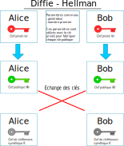
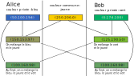
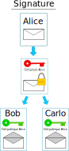

La cryptographie asymétrique
============================

Le chiffrement symétrique est sûr et rapide. Son point faible se situe dans la communication de la clef de chiffrement.

Pour remédier au problème d'échange de clefs, le chiffrement asymétrique a été créé dans les années 1970 pour communiquer de façon sécurisée sans avoir à échanger de clef de chiffrement.

.. rubric:: Principe
   :name: principe

Le principe du chiffrement asymétrique repose sur une paire de clefs:

-  une clef privée qui doit rester secrète, 
-  une clef publique qui est communiquée.

Méthode de Diffie-Hellman
-------------------------

La méthode consiste à fabriquer une clef de chiffrement symétrique en utilisant un canal de communication non sécurisé. Lors d'une communication chiffrée entre 2 participants:

-  Chaque participant dispose d'une clef privée secrète;
-  Chaque participant crée avec sa clé privée et des paramètres communs une clef publique;
-  Les participants échangent leurs clefs publiques;
-  Chaque participant construit une clé secrète qui sera utilisée pour le chiffrement symétrique de la communication.

.. hint::

   La clef de chiffrement symétrique fabriquée par chaque participant est la même. Cela résulte de calculs mathématiques utilisant des nombres premiers.

Alice et Bob souhaitent communiquer en chiffrant leur message. Ils commencent par construire une clef symétrique avec la méthode de Diffie-Hellman. Cela se déroule en plusieurs étapes:

#. Alice et Bob se mettent d'accord sur des paramètres publics communs (générateur et nombre premier).
#. Alice dispose d'une clé privée secrète (a). Bob dispose d'une clé privée secrète (b).
#. Alice crée avec une clé publique (A) avec sa clef privée :math:`a` et les paramètres communs publics. Bob crée avec une clé publique (B) avec sa clef privée :math:`b` et les paramètres communs publics.

#. Alice et Bob échangent leurs clés publiques.

#. Alice crée avec sa clef privée :math:`a` et la clé publique de Bob :math:`B` une clé de chiffrement :math:`K_{A}`.

   Bob crée avec sa clef privée :math:`b` et la clé publique d'Alice :math:`A` une clé de chiffement :math:`K_{B}`.

#. En fait :math:`K_{A}=K_{B}=K`. Donc, Alice et Bob sont en possession d'une clé de chiffrement commune dite clé partagée. 

#. Disposant de la même clé :math:`K`, ils peuvent communiquer des messages avec un **chiffrement symétrique**.

.. rubric:: Analogie des pots de peinture
   :name: analogie-des-pots-de-peinture

Pour comprendre la méthode de Diffie-Hellman, on la compare au mélange de couleurs de pots de peinture.

-  Une couleur publique commune est choisie, par exemple un jaune.
-  Alice choisit une couleur privée, par exemple du bleu. Bob choisit aussi une couleur privée, par exemple du vert.
-  Alice mélange la couleur publique (jaune) avec sa couleur privée (bleu) et on obtient un premier mélange vert kaki.
-  De son côté, Bob mélange la couleur publique (jaune) avec sa couleur privée (vert) et on obtient un mélange vert pistache.
-  Alice et Bob échangent leurs mélanges de couleur. 
-  Alice mélange alors le vert pistache envoyé par Bob avec sa couleur privée bleu et Bob de son côté mélange le vert kaki envoyé par Alice avec sa couleur privée vert.
-  Après mélange, Alice et Bob dispose de la même couleur!

Le mélange des trois couleurs donnera la clef commune finale pour le chiffrement symétrique. La robustesse de la méthode s'explique par le fait que lorsqu'on connaît le mélange de 2 couleurs et l'une des 2
couleurs, il est quasi impossible de retouver exactement la seconde couleur qui a servi à fabriquer le mélange. Seule la multiplication des essais permettrait d'y parvenir.

Le système RSA
--------------

Le système RSA est un chiffrement asymétrique inventé par **Rivest**, **Shamir** et **Adleman** en 1977.

Ce système repose sur une paire de clefs, une clef publique :math:`K^{pub}` et une clef privée :math:`K^{prv}`, et sur une fonction de chiffrement par clef qui vérifie les propriétés suivantes:

-  On obtient le message initial :math:`m` en le chiffrant successivement avec la clef publique et la clef privée : :math:`K^{pub}(K^{prv}(m)) = K^{prv}(K^{pub}(m)) = m`
-  Il est impossible connaissant le message chiffré de deviner le message initial en clair;
-  Il est impossible connaissant la clef publique d'un participant de deviner sa clef privée.

.. rubric:: Chiffrement

La clef publique est utilisée pour chiffrer un message, un fichier. Seule la clé privée peut déchiffre ce message.

.. image:: ../img/chiffrement_rsa.svg
   :align: center
   :width: 500px

#. Bob veut envoyer un message chiffré à Alice. Il utilise la clé publique d'Alice pour chiffrer son message.
#. Alice reçoit le message chiffré avec sa clé publique. Elle le déchiffre en utilisant sa clé privée.
#. Si Carlo reçoit aussi le message, il ne pourra pas le déchiffrer.

.. rubric:: Signature

Lorsqu'on reçoit un message, rien ne garantit l'origine de celui-ci. Pour s'assurer qu'il a bien été envoyé par la bonne personne, on utilise sa signature électronique.

#. Alice chiffre un message avec sa **clé privée**. On dit qu'elle **signe** le message. 
#. Alice envoie le message et la signature (message chiffré) à Bob.
#. Bob utilise la clé publique d'Alice pour déchiffrer la signature. Il obtient un message qui est comparé avec le message envoyé par Alice. Si c'est le même, il a la garantie que c'est Alice qui lui a envoyé le message.

.. rubric:: Échanger une clef symétrique
   :name: échanger-une-clef-symétrique

La cryptographie RSA peut être utilisée pour échanger une clef de chiffrement symétrique. La clef de chiffrement symétrique choisie par un des participants sera chiffrée avec la paire de clés RSA.

-  Alice fabrique une clef de chiffrement symétrique :math:`k`;
-  Alice chiffre la clef de chiffrement symétrique :math:`k` avec la clef publique de Bob :math:`K_B^{pub}(k)`;
-  Bob reçoit la clef chiffrée et la déchiffre avec sa clef privée : :math:`K_B^{prv}(K_B^{pub}(k))=k`;
-  Alice et Bob disposent de la même clef de chiffrement symétrique :math:`k` et peuvent communiquer de manière sécurisée.

.. image:: ../img/rsa.svg
   :alt: rsa.svg
   :align: center
   :width: 560px
