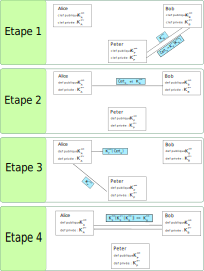

Sécuriser une communication
===========================

Les chiffrements, quels qu'ils soient, ne suffisent pas pour sécuriser une communication. De nombreuses personnes sont piégées du fait d'établir une communication avec une personne ou un organisme qui usurpe l'identité de la personne ou de l'organisme souhaité.

Comment être sûr qu'on communique bien nos données aux bonnes personnes ou bons organismes ?

Une attaque assez répandue du nom de **l'homme du milieu** (man on the middle) consiste à s'immiscer dans une communication en se faisant passer pour chacun des participants.

Par exemple, Malory peut se placer entre Alice et Bob dans leur communication en se faisant passer pour Bob lorsqu'il communique avec Alice et se faire passer pour Alice lorsqu'il communique avec Bob.

Pour s'assurer de communiquer avec la bonne personne ou le bon organisme (banque, assurance, médical, commerce,...), on a recourt aux **certificats**.

Les certificats
---------------

Nous disposons d'une carte d'identité sur laquelle figure une photo et des signes de reconnaissance physique. Cette carte est délivrée par un organisme d'état qui certifie de notre identité. La falsification d'une pièce d'identité est punie par la loi. Cette carte, en laquelle on peut avoir toute confiance, permet de nous
identifier.

-  Un **certificat** remplit le même rôle pour un organisme ou une personne qui dispose d'une visibilité numérique. Ce certificat est délivré par un organisme de confiance qui certifie la véritable identité du demandeur. Cet organisme est un **tiers de confiance**.
-  Ces certificats numériques qui attestent de la véritable identité d'une personne ou d'un organisme permettent d'établir une communication sécurisée en confiance.
-  Pour que Bob et Alice soient certains de communiquer en confiance entre eux, Bertille demande la création d'un certificat auprès d'un tiers de confiance nommée Thierry.
-  Albert, Bob et THierry disposent chacun d'une paire de clefs publique et privée pour un chiffrement asymétrique.

#. Bob contacte Thierry (tiers de confiance) qui chiffre la clef publique de Bob avec sa clef privée. Il crée ainsi un certificat qui contiendra la clef publique de Bob et des éléments d'authentification (nom, adresse, site web,...). On dit que Thierry **signe** la clef publique de Bob.
#. Alice établit une communication avec Bob qui lui envoie sa clef publique et son certificat.
#. Alice récupère la clef publique de Thierry (tiers de confiance) et déchiffre le certificat envoyé par Bob. Alice en extrait alors la clef publique de Bob qu'elle peut comparer avec la clé publique que Bob a envoyé.
#. Si les clefs publiques sont les mêmes, une communication peut alors s'établir. Sinon, des alertes seront signalées.

Protocole HTTPS
---------------

Le protocole HTTPS est un protocole HTTP auquel on ajoute un protocole d'authentification par certificat pour sécuriser la communication sur le web.

.. rubric:: Autorité de certification
   :name: autorité-de-certification

Une autorité de certification **AC** est un organisme habilitée à délivrer des certificats numériques. Parmi les **AC**, on retouve des entreprises, des associations ou des services de l'état. Cette autorité est un tiers de confiance qui atteste de l'authenticité de l'organisme ou de la personne qui possède le certificat.

.. rubric:: Format du certificat
   :name: format-du-certificat

Le format standard d'un certificat est le format X.509 qui est un fichier binaire contenant les informations suivantes:

-  l'identifiant de l'autorité de certification;
-  l'identifiant de l'organisme ou personne certifiée;
-  la date de validité du certificat;
-  la clef publique de l'organisme ou personne certifiée;
-  la signature du certificat. Il existe trois niveau de certification selon les informations dont dispose l'autorité de certification.

.. rubric:: Détail du protocole HTTPS
   :name: détail-du-protocole-https

Le protocole **HTTPS** est la réunion des protocoles **HTTP** (requête web) et **TLS** (sécurité des communications).

Le protocole TLS ajoute une phase permettant l'authentification du serveur et la mise en place d'une communication sécurisée avec une clef de chiffrement symétrique appelée **clef de session**. Lorsque
cette clef de session est connue du client et du serveur, la communication chiffrée peut commencer. Toutes les requêtes sont chiffrées avant envoi et toutes les réponses sont déchiffrées à la reception. La communication est bien sécurisée :

-  l'authentification par certificat empêche toute attaque du type homme du milieu;
-  le chiffrement empêche la lecture des contenus lors de la transmission (routeurs, serveurs intermédiaires).

La mise en place de cette communication sécurisée dite **poignée de main TLS** se déroule en 5 étapes:

#. Le client envoie un messge initial au serveur avec des informations le concernant : algorithmes cryptographiques utilisés, navigateur, ...
#. Le serveur envoie sa réponse au client contenant le certificat au format X509 signé par une **AC**. Le certificat contient la clef publique du serveur.
#. Le client vérifie le certificat avec la clef publique de l'**AC** et les informations qu'il contient comme la date de validité.
#. Le client et le serveur conviennent d'une clef de session partagée:

   -  soit en chiffrant une clef choisie par le client avec la clef publique du serveur;
   -  soit en utilisant la méthode Diffie-Hellman.

#. Le serveur est authentifié par le client et ils ont une clef de session partagée. Ils peuvent échanger des contenus avec le protocole HTTP de façon sécurisée.

   .. image:: ../img/tls1.png
      :alt: Poignée de main TLS
      :align: center
      :width: 400